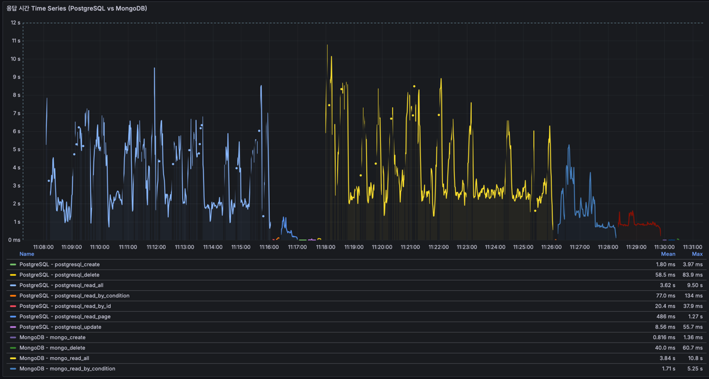
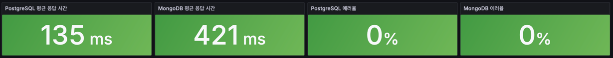
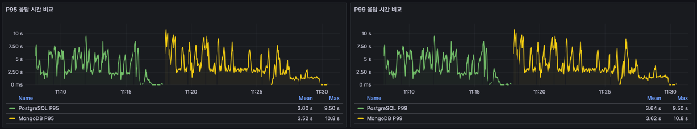
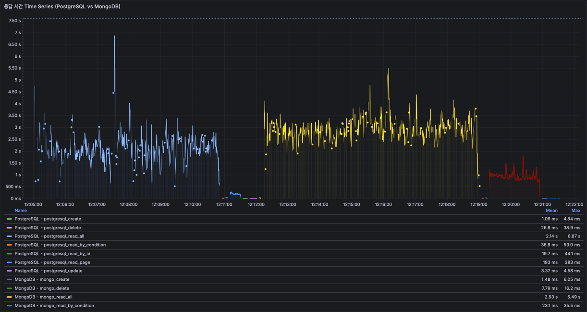
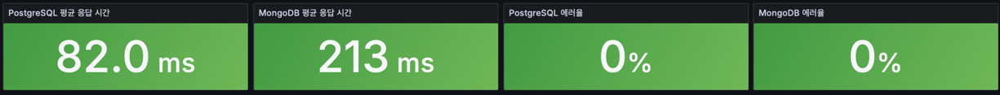
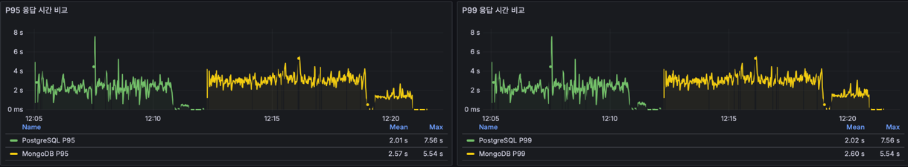

# PostgreSQL vs MongoDB — Chat Benchmark

> DAU ~1,000 규모의 실시간 채팅 서비스에서 어떤 메시지 저장 전략이 더 적합한지 판단하기 위한 성능 벤치마크


---

## 배경

채팅 기능 도입을 앞두고 **"MongoDB가 채팅에 좋다고 하던데, DAU 1,000 수준에서도 의미 있는 차이가 날까?"** 라는 질문에 정량적으로 답하기 위해 진행했다.

채팅 메시지 데이터는 아래 특성을 가진다.

- 메시지는 지속적으로 누적되는 append 중심 데이터다.
- 단건 조회보다 `최신 메시지 목록`, `이전 메시지 페이지 조회`처럼 정렬과 범위 조회가 더 중요하다.
- 메시지 생성은 자주 발생하지만, 수정은 읽음 처리나 일부 내용 변경처럼 제한적인 편이다.
- 데이터 구조 자체는 비교적 단순하며, 현재 시나리오에서는 복잡한 다중 필터 검색보다 대표 조회 패턴의 성능이 더 중요하다.

즉 이 비교는 "채팅 데이터가 문서형이라 MongoDB가 무조건 유리하다"를 전제하지 않고, **실제 채팅 데이터의 조회/쓰기 특성상 어떤 저장소가 더 실용적인지** 를 검증하는 데 목적이 있다.

---

## 판단 기준

- **데이터 정합성 vs 성능:** 쓰기가 빈번해도 조회 응답 시간은 안정적으로 유지되어야 한다.
- **인덱스 의존성:** 인덱스 유무에 따라 조건 조회 성능이 크게 달라질 수 있어, 인덱스 전후를 나눠 봐야 한다.
- **운영 복잡도:** 성능 차이가 크지 않다면 이중 DB 운영보다 단일 저장소 유지가 더 실용적일 수 있다.

---

## 가설 설정 (Hypothesis)

| 시나리오 | 가설 | 근거                                                            |
|:---|:---|:--------------------------------------------------------------|
| **H1 (전체 조회)** | 전체 조회는 `PostgreSQL`이 더 유리할 수 있다. | 평평한 스키마에서는 row 기반 전체 조회가 더 단순할 수 있다. |
| **H2 (PK 조회)** | PK 조회는 큰 차이가 없을 수 있다. | PostgreSQL `B-tree PK`와 MongoDB `_id` 인덱스 모두 단건 탐색에 최적화 되어있다. |
| **H3 (조건 조회)** | `senderId` 조건 조회는 인덱스 유무에 가장 크게 영향받을 수 있다. | 단일 필드 인덱스를 타면 빠르지만, 없으면 둘 다 스캔 비용이 커진다. |
| **H4 (페이지 조회)** | 페이지 조회는 `PostgreSQL`이 더 유리할 수 있다. | 정렬 + 페이지네이션 비용 차이가 직접 드러나는 시나리오다. |
| **H5 (삽입)** | 삽입은 `MongoDB`가 더 유리할 수 있다. | append 중심 메시지 쓰기에서는 MongoDB가 유리할 수 있다. |
| **H6 (수정)** | 수정은 `MongoDB`가 더 유리할 수 있다. | 둘 다 read-modify-write 경로를 타므로 실제 차이는 저장 엔진 구현에서 갈릴 수 있다. |
| **H7 (삭제)** | 삭제는 `MongoDB`가 더 유리할 수 있다. | 둘 다 ID 기반 단건 삭제이며, 실제 비용 차이는 저장 구조와 인덱스 유지 비용에서 갈릴 수 있다. |

---

## 가설 검증 기준

- **Read**: 전체 조회, PK 조회, 조건 조회, 페이지 조회의 평균 응답 시간과 tail latency를 함께 본다.
- **Write**: 삽입, 수정, 삭제의 평균 응답 시간과 처리량을 함께 본다.
- **Index Effect**: 인덱스 없음 1차 결과와 인덱스 추가 후 2차 결과를 나눠 본다.
- **Final Decision**: 시나리오별 승패와 채팅 핵심 시나리오의 중요도를 함께 해석한다.

---

## 측정 조건

- **데이터 규모**: 채팅 메시지 10만 건
- **실행 방식**: 각 시나리오 1회 실행
- **1차 측정**: 인덱스 없음
- **2차 측정**: 인덱스 추가 후 재측정
- **PostgreSQL 인덱스**: `sender_id`, `room_id`, `created_at`
- **MongoDB 인덱스**: `senderId`, `roomId`, `createdAt`

---

## 결과

**테스트 데이터**: 채팅 메시지 10만 건 / 각 시나리오 기본 1회 실행 / 인덱스 없음(1차) · 인덱스 추가(2차) 두 차례 측정

### 1차 — 인덱스 없음

| 시나리오 | PostgreSQL avg | MongoDB avg | 승자 |
|:---|---:|---:|:---|
| 전체 조회 | 2.50 s | 3.59 s | PostgreSQL |
| PK 조회 | 21.3 ms | 18.5 ms | MongoDB |
| 조건 조회 (`senderId`) | 58.9 ms | 1.21 s | PostgreSQL |
| 페이지 조회 | 329 ms | 886 ms | PostgreSQL |
| 삽입 | 1.47 ms | 0.787 ms | MongoDB |
| 수정 | 5.50 ms | 3.75 ms | MongoDB |
| 삭제 | 61.2 ms | 40.1 ms | MongoDB |





1차 해석:

- 평균 응답 시간은 `PostgreSQL 135ms`, `MongoDB 421ms`로 PostgreSQL이 약 3배 빠르다.
- 에러율은 둘 다 `0%`다.
- 조건 조회와 페이지 조회 같은 채팅 핵심 read path는 PostgreSQL이 우세하다.
- PK 조회, 삽입, 수정, 삭제는 MongoDB가 더 빠르다.
- 따라서 1차 결과만 보면, 현재 채팅 시나리오에서는 MongoDB보다 PostgreSQL이 더 적합하다고 해석할 수 있다.

### 1차 가설 검증

| 가설 | 결과 | 검증 |
|:---|:---|:---|
| **H1 (전체 조회)** | PostgreSQL `2.50s` vs MongoDB `3.59s` | 적중 |
| **H2 (PK 조회)** | PostgreSQL `21.3ms` vs MongoDB `18.5ms` | 적중 |
| **H3 (조건 조회)** | PostgreSQL `58.9ms` vs MongoDB `1.21s` | 적중 |
| **H4 (페이지 조회)** | PostgreSQL `329ms` vs MongoDB `886ms` | 적중 |
| **H5 (삽입)** | PostgreSQL `1.47ms` vs MongoDB `0.787ms` | 적중 |
| **H6 (수정)** | PostgreSQL `5.50ms` vs MongoDB `3.75ms` | 적중 |
| **H7 (삭제)** | PostgreSQL `61.2ms` vs MongoDB `40.1ms` | 적중 |

1차에서는 설정한 시나리오별 가설이 모두 실제 결과와 같은 방향으로 나타났다.

### 2차 — 인덱스 추가 후

- PostgreSQL 인덱스: `sender_id`, `room_id`, `created_at`
- MongoDB 인덱스: `senderId`, `roomId`, `createdAt`

| 시나리오 | PostgreSQL avg | MongoDB avg | 승자 |
|:---|---:|---:|:---|
| 전체 조회 | 2.16 s | 2.94 s | PostgreSQL |
| PK 조회 | 19.4 ms | 21.0 ms | PostgreSQL |
| 조건 조회 (`senderId`) | 36.1 ms | 23.9 ms | MongoDB |
| 페이지 조회 | 193 ms | 931 ms | PostgreSQL |
| 삽입 | 0.836 ms | 1.01 ms | PostgreSQL |
| 수정 | 3.32 ms | 3.18 ms | MongoDB |
| 삭제 | 28.2 ms | 6.41 ms | MongoDB |





2차 해석:

- 평균 응답 시간은 `PostgreSQL 82.0ms`, `MongoDB 213ms`로 PostgreSQL이 여전히 앞선다.
- 에러율은 둘 다 `0%`다.
- 조건 조회는 인덱스 적용 후 `PostgreSQL 58.9ms -> 36.1ms`, `MongoDB 1.21s -> 23.9ms`로 모두 크게 개선됐고 MongoDB가 앞섰다.
- 페이지 조회는 `PostgreSQL 193ms`, `MongoDB 931ms`로 인덱스 적용 후에도 PostgreSQL 우위가 유지됐다.
- 삽입은 PostgreSQL이 앞섰고, 수정과 삭제는 MongoDB가 더 빨랐다.

### 2차 가설 검증

| 가설 | 결과 | 검증 |
|:---|:---|:---|
| **H1 (전체 조회)** | PostgreSQL `2.16s` vs MongoDB `2.94s` | 적중 |
| **H2 (PK 조회)** | PostgreSQL `19.4ms` vs MongoDB `21.0ms` | 빗나감 |
| **H3 (조건 조회)** | PostgreSQL `36.1ms` vs MongoDB `23.9ms` | 적중 |
| **H4 (페이지 조회)** | PostgreSQL `193ms` vs MongoDB `931ms` | 적중 |
| **H5 (삽입)** | PostgreSQL `0.836ms` vs MongoDB `1.01ms` | 빗나감 |
| **H6 (수정)** | PostgreSQL `3.32ms` vs MongoDB `3.18ms` | 적중 |
| **H7 (삭제)** | PostgreSQL `28.2ms` vs MongoDB `6.41ms` | 적중 |

2차에서는 `H2`, `H5`를 제외한 가설이 결과와 같은 방향으로 나타났다.

### 전체 지표 비교

| 지표 | PostgreSQL 1차 | MongoDB 1차 | PostgreSQL 2차 | MongoDB 2차 |
|:---|---:|---:|---:|---:|
| 전체 평균 응답 시간 | 135 ms | 421 ms | 82.0 ms | 213 ms |
| 평균 에러율 | 0% | 0% | 0% | 0% |
| P95 평균 | 3.60 s | 3.52 s | 2.01 s | 2.57 s |
| P99 평균 | 3.64 s | 3.62 s | 2.02 s | 2.60 s |
| 최대 응답 시간 | 9.50 s | 10.8 s | 7.56 s | 5.54 s |

---

## 결론

최종 결론은 `PostgreSQL 유지`다.

- 1차와 2차 모두 전체 평균 응답 시간에서 PostgreSQL이 앞섰다. `135ms vs 421ms`, `82.0ms vs 213ms`로 격차가 일관됐다.
- 채팅 저장소 선택에서 가장 중요하게 본 페이지 조회도 두 차례 모두 PostgreSQL이 우세했다. 1차 `329ms vs 886ms`, 2차 `193ms vs 931ms`로 인덱스 적용 후에도 격차가 유지됐다.
- 조건 조회는 인덱스 추가 후 MongoDB가 `23.9ms`까지 내려오며 역전했지만, 이 단일 시나리오만으로 전체 선택이 바뀌지는 않았다.
- MongoDB는 PK 조회, 수정, 삭제 같은 일부 시나리오에서 강점을 보였고 1차에서는 삽입도 더 빨랐다. 다만 현재 서비스 판단에서는 쓰기보다 핵심 조회 경로의 안정적 응답 시간이 더 중요하다.
- 에러율은 1차와 2차 모두 두 저장소가 `0%`였으므로, 이번 판단은 장애 대응보다 순수 성능과 운영 복잡도 기준으로 내려도 무리가 없다.
- 운영 관점에서도 PostgreSQL 단일 유지가 더 단순하다. MongoDB를 별도로 도입하면 저장소 이원화, 백업 전략 분리, 모니터링 포인트 증가 같은 비용이 생기는데, 이번 결과만으로 그 복잡도를 감수할 이유는 충분하지 않았다.
- 현재 메시지 구조는 비교적 단순하므로 문서 지향 스키마의 유연성이 결정적 장점으로 이어지지 않았다. 이후 메시지 payload가 복잡해진다면 `PostgreSQL JSONB` 같은 대안과 함께 다시 검토할 수 있다.

즉, 이번 벤치마크는 MongoDB가 일부 쓰기 시나리오에서 빠를 수는 있지만, DorumDorum 채팅 서비스의 핵심 사용 패턴까지 포함하면 PostgreSQL이 더 실용적이다라는 결론으로 정리된다.

---

## 테스트 환경

| 항목 | 사양 |
|------|------|
| OS | macOS / Linux 단일 머신 |
| CPU | 측정 환경 기준 기입 |
| RAM | 측정 환경 기준 기입 |
| 구동 방식 | Docker Compose 단일 머신 |
| PostgreSQL | 16 |
| MongoDB | 7.0 |
| App | Spring Boot 3.5 |

---

## How to Run

```bash
# 1. 전체 스택 기동
docker compose up -d

# 2. 앱 기동 확인
docker compose logs -f app

# 3. 데이터 시딩
cd seed
python3 -m pip install -r requirements.txt
python3 seed.py

# 4. 벤치마크 실행
cd ../k6
./run-all.sh

# 5. 인덱스 추가 후 2차 측정
cd ../seed
python3 add-indexes.py

cd ../k6
./run-all.sh
```

결과 확인:
- Grafana: `http://localhost:3000`
- 계정: `admin / admin`
- PostgreSQL: `localhost:55432`
- MongoDB: `localhost:37017`
- App: `localhost:8080`

---

## 프로젝트 구조

```text
.
├── docker-compose.yml        — PostgreSQL, MongoDB, Spring Boot, InfluxDB, Grafana
├── seed/
│   ├── seed.py               — 10만 건 시드 데이터 생성
│   ├── add-indexes.py        — PostgreSQL / MongoDB 인덱스 생성에 사용 가능
│   └── requirements.txt
├── k6/
│   ├── config.js             — 공통 옵션
│   ├── postgresql/           — PostgreSQL(RDB) 시나리오 7개
│   ├── mongo/                — MongoDB 시나리오 7개
│   └── run-all.sh            — 전체 시나리오 순차 실행
├── grafana/
│   └── provisioning/         — Grafana 자동 설정
├── spring-app/               — Spring Boot 벤치마크 앱
└── report/
    └── visualization/          — Grafana 스크린샷
```
